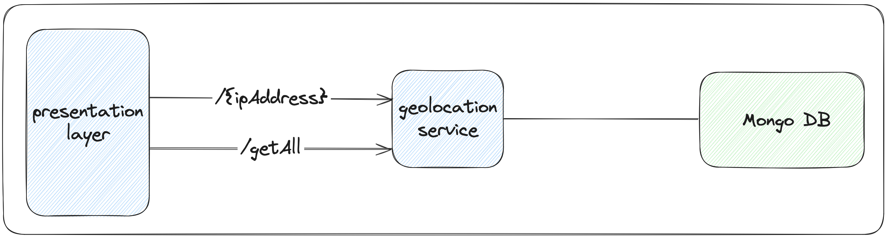
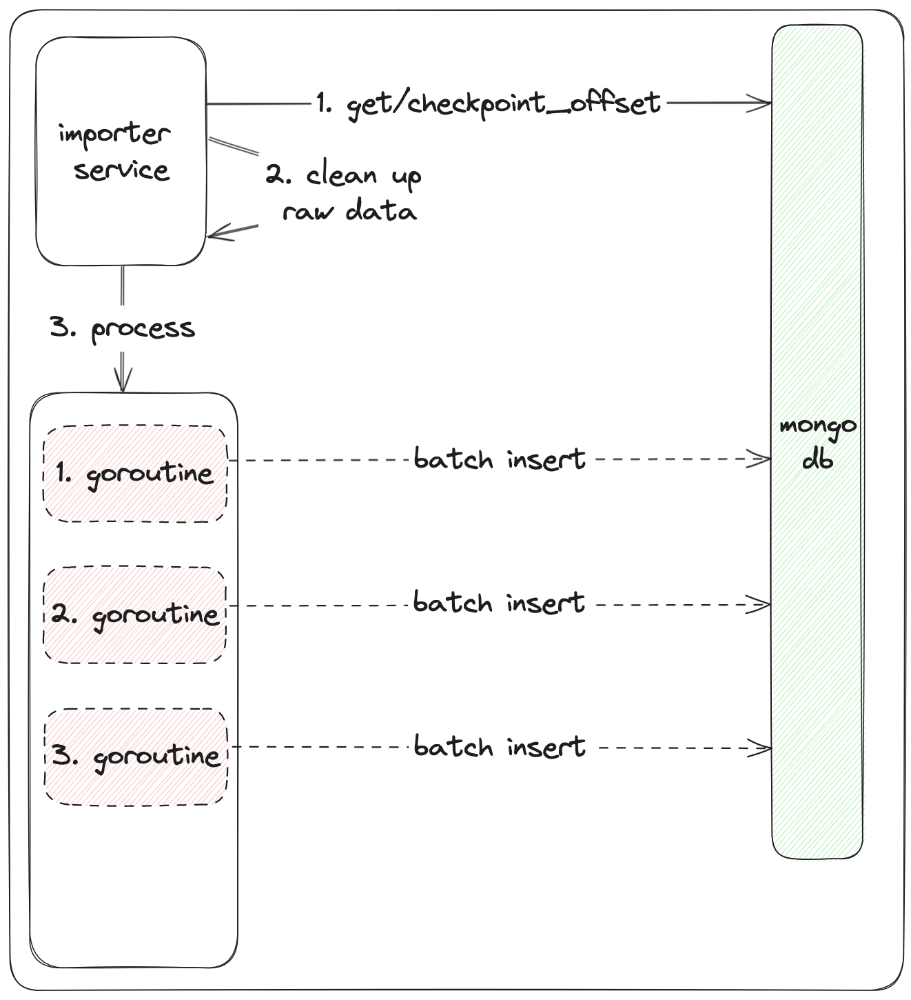
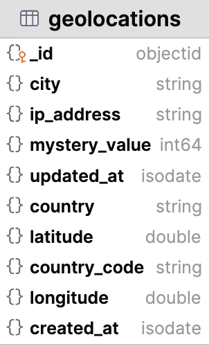
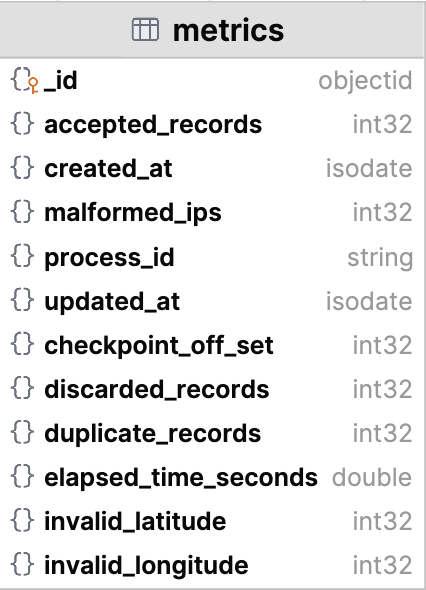

<h1 align="center"> geolocation service </h1>
<p align="center">  
 Microservice for providing geolocation data 
</p>

## Table of Contents

- [Introduction](#introduction)
- [API Documentation](#api)
    - [getGeolocationByIpAddress](#getgeolocationbyipaddress)
    - [getGeolocations](#getgeolocations)
- [Running the Geolocation Service](#running-the-geolocation-service)
- [Testing the Geolocation Service](#testing-the-geolocation-service)
- [Introduction to Importer Service](#introduction-to-importer-service)
- [Running the Importer Service](#running-the-importer-service)
- [Testing the Importer Service](#testing-the-importer-service)
- [Data Model](#Data-Model)
  - [Geolocations collection](#geolocation-collection)
  - [Metrics collection](#metrics-collection)

## Introduction
This service responsible for providing geolocation data. It has two api, first for getting 
specific location data by `ipAddress`. Second is gets all location data. For database, we are
using mongo db.


## API
For swagger documentation, use this [link](http://localhost:8001/swagger/) after running application.

## getGeolocationByIpAddress

<a id="getGeolocationByIpAddress"></a>


```http
GET /localhost:8001/v1/geolocation-service/geolocations/{ipAddress} HTTP/1.1

Content-Type: application/json
```

## getGeolocations

<a id="getGeolocationByIpAddress"></a>


```http
GET /localhost:8001/v1/geolocation-service/geolocations?offset=1&limit=10 HTTP/1.1

Content-Type: application/json
```

## Running-the-geolocation-service
For running geolocation service, just need to execute command below:
```shell
docker-compose up --build -d api
```

## Testing-Geolocation-Service
For testing geolocation service, just need to execute command below:
```shell
docker-compose exec api make test-api
```

## Introduction-to-Importer-service
This service responsible for importing raw data from external sources. It follows 
checkpointing strategy and parallel processing with batch operations on mongo db.
There are three main step in the flow.
1. Get last checkpoint location
2. Clean up raw data
3. Batch insert to db with goroutines


## Running-the-Importer-Service
For running importer service, just need to execute command below:
```shell
docker-compose up --build -d importer
```

## Testing-the-Importer-Service
For testing importer service, just need to execute command below:
```shell
docker-compose exec importer make test-importer
```

## Data-Model
### Geolocation-collection

### Metrics-collection

